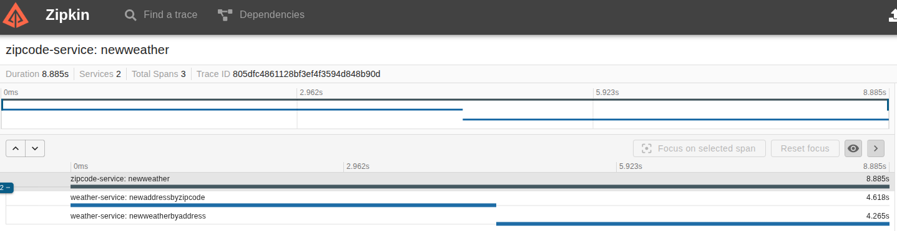

# Desafio Pós Go Expert - Observabilidade & Open Telemetry

> Este projeto contém a solução para o desafio de Observabilidade & Open Telemetry da pós-graduação Go Expert da FullCycle.

(...) Desenvolver um sistema em Go que receba um CEP, identifica a cidade e retorna o clima atual (temperatura em graus celsius, fahrenheit e kelvin) juntamente com a cidade. Esse sistema deverá implementar OTEL(Open Telemetry) e Zipkin.

Basedo no cenário conhecido "Sistema de temperatura por CEP" denominado Serviço B, será incluso um novo projeto, denominado Serviço A.

Requisitos - Serviço A (responsável pelo input):

- O sistema deve receber um input de 8 dígitos via POST, através do schema:  { "cep": "29902555" }
- O sistema deve validar se o input é valido (contem 8 dígitos) e é uma STRING
    - Caso seja válido, será encaminhado para o Serviço B via HTTP
    - Caso não seja válido, deve retornar:
        - Código HTTP: 422
        - Mensagem: invalid zipcode

Requisitos - Serviço B (responsável pela orquestração):

- O sistema deve receber um CEP válido de 8 digitos
- O sistema deve realizar a pesquisa do CEP e encontrar o nome da localização, a partir disso, deverá retornar as temperaturas e formata-lás em: Celsius, Fahrenheit, Kelvin juntamente com o nome da localização.
- O sistema deve responder adequadamente nos seguintes cenários:
    - Em caso de sucesso:
        - Código HTTP: 200
        - Response Body: { "city: "São Paulo", "temp_C": 28.5, "temp_F": 28.5, "temp_K": 28.5 }
    - Em caso de falha, caso o CEP não seja válido (com formato correto):
        - Código HTTP: 422
        - Mensagem: invalid zipcode
    - ​​​Em caso de falha, caso o CEP não seja encontrado:
        - Código HTTP: 404
        - Mensagem: can not find zipcode

Após a implementação dos serviços, adicione a implementação do OTEL + Zipkin:

- Implementar tracing distribuído entre Serviço A - Serviço B
- Utilizar span para medir o tempo de resposta do serviço de busca de CEP e busca de temperatura

Dicas

- Utilize a API viaCEP (ou similar) para encontrar a localização que deseja consultar a temperatura: https://viacep.com.br/
- Utilize a API WeatherAPI (ou similar) para consultar as temperaturas desejadas: https://www.weatherapi.com/
- Para realizar a conversão de Celsius para Fahrenheit, utilize a seguinte fórmula: F = C * 1,8 + 32
- Para realizar a conversão de Celsius para Kelvin, utilize a seguinte fórmula: K = C + 273
    - Sendo F = Fahrenheit
    - Sendo C = Celsius
    - Sendo K = Kelvin
- Para dúvidas da implementação do OTEL, você pode [clicar aqui](https://opentelemetry.io/docs/languages/go/getting-started/)
- Para implementação de spans, você pode [clicar aqui](https://opentelemetry.io/docs/languages/go/instrumentation/#creating-spans)
- Você precisará utilizar um serviço de [collector do OTEL](https://opentelemetry.io/docs/collector/quick-start/)
- Para mais informações sobre Zipkin, você pode [clicar aqui](https://zipkin.io/)

Entrega

- O código-fonte completo da implementação.
- Documentação explicando como rodar o projeto em ambiente dev.
- Utilize docker/docker-compose para que possamos realizar os testes de sua aplicação.

# Executando a aplicação

### Pré-requisitos

- Crie uma chave de API em https://www.weatherapi.com/
- Insira a chave de API no arquivo `.env`

*Para este projeto, já define uma chave no arquivo .env para testes e validação da entrega

### Iniciando os serviços

Inicie os containers através do docker compose:

```sh
docker compose up -d
```

- Zipkin (tracing): http://127.0.0.1:9411
- ZipCodeService: http://localhost:8080/zipcode
- WeatherService: http://localhost:8081/weather

### Testando endpoints

1. Realize a chamada do serviço A (zipcode)

    ```sh
    curl --request POST \
        --url http://localhost:8080/zipcode/ \
        --header 'Content-Type: application/json' \
        --data '{"cep":"89036400"}'
    ```

    Para realizar uma chamada ao serviço B (weather)

    ```sh
    curl --request GET \
        --url http://localhost:8081/zipcode/89036400
    ```

2. Visualizando os trancings

    Após enviar requisições para os serviços, você pode visualizar os traces no Zipkin (http://127.0.0.1:9411). Os spans devem mostrar a sequência de chamadas entre os serviços ZipCodeService e WeatherService.

    